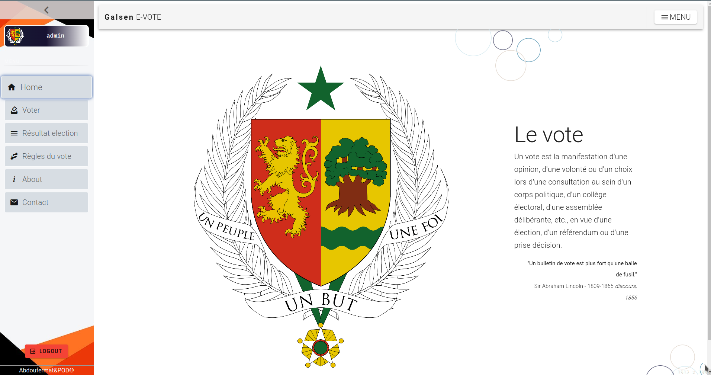

# Galsen E-Vote



--
## APP SMART CONTRACT

>> Folder: voting_app

install ibm blcokchain extension [link](https://marketplace.visualstudio.com/items?itemName=IBMBlockchain.ibm-blockchain-platform)


> NEXT: create local environment, deploy smart contract [link](https://developpaper.com/develop-your-first-fabric-smart-contract-with-ibm-blockchain-platform-extension/)

--

## APP SERVER

>> Folder server_app

open terminal in root directory
```
node enrollAdmin.js
```
Then start the server

```
npm start
```

## APP CLIENT

>> Folder: main folder bc_app

```
npm install
```

### Compiles and hot-reloads for development
```
npm run dev
```

### Compiles and minifies for production
```
npm run build
```

### Customize configuration
See [Configuration Reference](https://cli.vuejs.org/config/).


# DEMO

<a href="https://www.loom.com/share/7f964cabf846445091ac2c775b90f8b2">
    <p>Galsen E-VOTE demo</p>
    
</a>